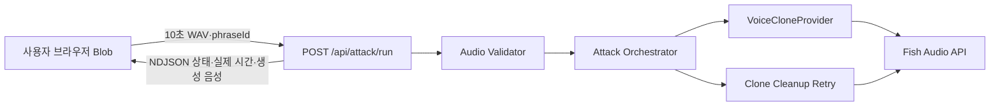
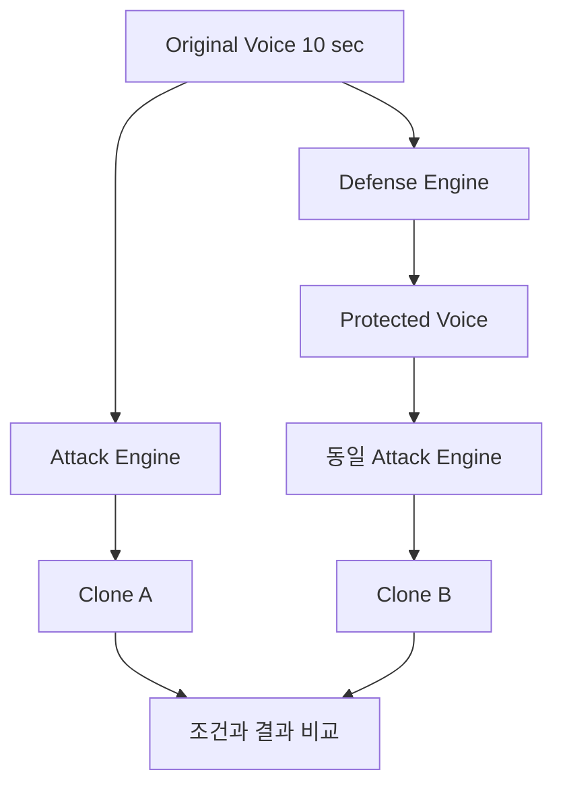

# VoiceShield Attack Simulator MVP 기획서

> 상태: Draft v0.1  
> 기준일: 2026-09-16  
> 구현 위치: `attack-simulator/`  
> 제품 성격: 본인 음성을 이용한 방어 효과 검증 및 보안 교육용 시뮬레이터

## 1. 핵심 판단

VoiceShield Attack Simulator는 기존 탐지·방어 구현과 독립된 Next.js 애플리케이션으로 개발한다. MVP는 사용자가 브라우저에서 직접 녹음한 정확히 10초 분량의 본인 음성으로 제한된 Voice Clone을 만들고, 사용자가 실제로 말하지 않은 고정 문장을 생성해 원본과 비교 재생하는 경험에 집중한다.

먼저 최소 파이프라인을 실제 Provider로 검증한 뒤 스트리밍 API와 UI를 확장한다.

```text
10초 본인 음성 녹음
        ↓
서버 오디오 검증·정규화
        ↓
Voice Clone Provider
        ↓
고정된 안전 문장 생성
        ↓
원본/생성 음성 비교와 실제 처리 시간 표시
```

## 2. 프로젝트 목표

### 2.1 제품 목표

사용자가 다음 사실을 짧고 명확한 흐름으로 직접 확인하게 한다.

> 공격자에게 필요한 것은 단 10초였습니다.

사용자는 본인 음성을 10초간 녹음하고, 자신이 말하지 않은 고정 문장이 유사한 목소리로 생성되는 과정을 체험한다. 이후 동일한 Attack Engine에 방어 처리된 음성을 입력해 방어 전후 복제 결과를 비교할 수 있어야 한다.

### 2.2 MVP 성공 조건

배포된 웹서비스에서 다음 전체 흐름이 실제로 완료되어야 한다.

1. 사용자가 본인 음성 사용과 Voice Cloning 테스트에 동의한다.
2. 브라우저가 마이크 권한을 받고 녹음을 시작한다.
3. 10초 후 녹음이 자동으로 종료된다.
4. 사용자가 녹음을 확인하고 다시 녹음하거나 사용할 수 있다.
5. 서버가 파일 형식, 길이, 크기와 최소 음량을 검증한다.
6. 실제 Voice Clone Provider가 참조 음성을 처리한다.
7. 사용자가 선택한 고정 문장을 복제 음성으로 생성한다.
8. 사용자가 원본과 생성 결과를 웹에서 재생할 수 있다.
9. 녹음, 복제, 생성 및 전체 처리 시간을 실제 측정값으로 확인한다.
10. 성공, 실패, 취소 시 Provider Clone 삭제를 시도하고 브라우저 데이터를 정리한다.

### 2.3 품질 우선순위

1. 실제 Voice Clone 파이프라인의 성공과 안정성
2. 본인 음성 동의, 입력 제한, 임시 데이터 삭제
3. 실패 원인을 이해할 수 있는 오류 처리
4. 끊김 없는 녹음·처리·비교 경험
5. 시각 효과와 부가 지표

## 3. 범위

### 3.1 P0 — MVP 필수

- 본인 음성 및 AI Voice Cloning 테스트에 대한 명시적 동의
- 브라우저에서 직접 수행하는 10초 녹음
- 녹음 중 경과 시간과 입력 음량 표시
- 10초 자동 종료, 녹음 재생, 다시 녹음, 사용 확정
- 서버의 실제 오디오 디코딩과 기본 품질 검증
- 교체 가능한 Voice Clone Provider 인터페이스
- Fish Audio Provider 1개 구현
- 서버가 관리하는 고정 안전 문구 3개 중 하나 선택
- 실제 Voice Clone 및 음성 생성
- 원본과 생성 음성의 비교 재생
- 실제 단계별 처리 시간 표시
- 실패, 타임아웃, 중복 요청에 대한 안전한 처리
- 요청 완료·실패·취소 시 Provider 자원 삭제 시도
- Vercel 배포 환경에서의 전체 흐름 검증

### 3.2 P1 — 안정화 단계

- 파형 시각화
- 세부 음량 및 무음 검사
- 실제 서버 상태에 연결된 진행 표시
- 페이지 이탈 시 요청 취소와 브라우저 Blob 정리
- 보호 음성 입력을 받을 수 있는 내부 Attack Engine 인터페이스
- 운영 지표 및 정리 실패 모니터링

### 3.3 P2 — 확장 단계

- Original/Protected 입력에 대한 동일 조건 A/B 비교
- 검증된 방법을 사용한 Speaker Similarity 측정
- 정의된 평가 데이터셋 기반 공격 성공률 시각화
- 개인정보가 포함되지 않는 결과 공유 이미지
- 추가 Voice Clone Provider 어댑터

### 3.4 MVP 제외 범위

- 전화망, SIP, WebRTC 통화 또는 실제 전화 녹음 연동
- 타인 음성 URL 수집과 음성 파일 업로드
- 타인 또는 임의 사용자 음성 데이터베이스
- 자유 문장 입력과 임의 사칭 문구 생성
- 금융, 송금, 인증, 긴급 요청 관련 문장
- Voice Cloning 모델 자체 학습
- 복잡한 회원가입, 결제, 관리자 페이지
- 임의 외부 서비스에 대한 공격 자동화
- 검증되지 않은 성공률 또는 화자 유사도 수치

## 4. 사용자와 핵심 시나리오

### 4.1 대상 사용자

- 본인 음성이 복제될 수 있는 위험을 체험하려는 일반 사용자
- 방어 처리 전후 결과를 같은 조건에서 검증하려는 VoiceZeroTrust 개발·평가 팀

### 4.2 대표 사용자 시나리오

```text
시작
  → 안내 확인
  → 본인 음성·테스트 동의
  → 마이크 권한 허용
  → 10초 녹음
  → 녹음 확인
  → 고정 문장 선택
  → 복제 및 음성 생성
  → 원본/생성 결과 비교
  → 테스트 종료 및 브라우저 데이터 삭제
```

### 4.3 핵심 메시지

- 진입: `10초면 당신의 목소리를 복제할 수 있을까요?`
- 처리: `ATTACK IN PROGRESS`
- 결과: `당신은 이 문장을 말한 적이 없습니다.`
- 설명: `AI가 10초의 음성만으로 생성했습니다.`

`ATTACK SUCCESS`는 기술적으로 정의된 성공 판정이 생기기 전까지 사용하지 않는다. 단순 생성 완료 상태는 `VOICE CLONE GENERATED`로 표현한다.

## 5. 화면 및 상호작용 명세

### 5.1 첫 화면

- 제품명: `AI VOICE CLONING ATTACK SIMULATOR`
- 핵심 질문과 10초 체험 설명
- 테스트가 본인 음성 및 고정 문장으로 제한된다는 안내
- 주요 버튼: `공격 시뮬레이션 시작`

### 5.2 동의 화면

다음 항목을 각각 선택해야 다음 단계로 이동할 수 있다.

- `현재 녹음할 음성은 제 본인의 음성입니다.`
- `AI Voice Cloning 테스트와 외부 Provider 처리에 동의합니다.`

동의 문구에는 최소한 처리 목적, 외부 전송 여부, 보관 기간, 삭제 방식과 Provider 정책 링크가 포함되어야 한다. 요청에는 서버가 검증할 수 있는 동의 문구 버전을 포함한다.

### 5.3 녹음 화면

- 제목: `VOICE SAMPLE ACQUISITION`
- 음소 다양성을 고려한 고정 녹음 문장
- 마이크 상태, `REC`, `00:00`부터 `00:10`까지의 타이머
- 입력 볼륨 또는 파형
- 10초 후 자동 종료
- 녹음 완료 후 `들어보기`, `다시 녹음`, `이 녹음 사용`

브라우저 타이머만 신뢰하지 않는다. 서버는 디코딩된 오디오의 실제 길이를 다시 검사한다.

### 5.4 문장 선택 화면

서버가 관리하는 다음 안전 문구 중 하나만 선택할 수 있다.

| ID | 문장 |
|---|---|
| `ai_disclosure` | 이 음성은 인공지능이 생성한 음성입니다. |
| `never_spoken` | 저는 이 문장을 실제로 말한 적이 없습니다. |
| `ten_seconds` | 단 10초의 음성만으로 새로운 문장이 만들어졌습니다. |

클라이언트는 `phraseId`만 서버에 전송한다. 서버는 ID를 허용 목록과 대조한 뒤 실제 문장을 결정하며 요청 본문에 포함된 임의 텍스트를 사용하지 않는다.

### 5.5 처리 화면

실제 서버 상태에 따라 다음 단계를 표시한다.

1. `VOICE SAMPLE ACQUIRED`
2. `VOICE CLONING`
3. `NEW SPEECH GENERATION`
4. `ATTACK RESULT`

처리 시간을 예측하거나 가짜 진행률을 만들지 않는다. 단계형 상태와 경과 시간만 표시하며, 장시간 작업에는 취소 버튼과 타임아웃 안내를 제공한다.

### 5.6 결과 화면

- 상태: `VOICE CLONE GENERATED`
- 녹음 길이
- Voice Clone 처리 시간
- 새 문장 생성 시간
- 전체 처리 시간
- `Original Voice` 재생기
- `AI Generated Voice` 재생기
- 생성 문장과 AI 생성 사실 안내
- `테스트 종료 및 데이터 삭제` 버튼

### 5.7 상태별 UX

| 상태 | 사용자에게 보이는 결과 |
|---|---|
| 초기 | 동의 전에는 녹음 시작 버튼 비활성화 |
| 마이크 요청 중 | 권한 요청 안내와 로딩 상태 |
| 권한 거부 | 브라우저별 권한 설정 안내와 재시도 버튼 |
| 녹음 중 | 타이머, 중지 불가 안내, 입력 음량 |
| 녹음 없음 | 재생·업로드 버튼 비활성화 |
| 품질 미달 | 원인과 조용한 환경에서 다시 녹음하라는 안내 |
| Provider 처리 중 | 현재 단계, 경과 시간, 취소 버튼 |
| 실패 | 안전한 오류 메시지, 재시도 또는 새 녹음 선택 |
| 완료 | 원본·생성 결과와 실제 측정값 표시 |

### 5.8 반응형 배치

- 모바일: 한 열로 녹음, 진행, 결과를 순차 배치하고 주요 버튼은 엄지손가락으로 누르기 쉬운 크기로 제공한다.
- 데스크톱: 결과 단계에서 Original Voice와 AI Generated Voice를 2열로 비교한다.
- 작은 화면에서도 동의 문구, 오류 메시지, 녹음 상태가 잘리거나 가려지지 않아야 한다.
- 기존 VoiceZeroTrust의 보안 교육 표현과 상태 색상 체계를 재사용하되 Attack Simulator 자체 빌드에는 기존 Python UI 의존성을 가져오지 않는다.

## 6. 시스템 경계와 구성

### 6.1 저장소 구성

```text
VoiceZeroTrust/
├── attack-simulator/
│   ├── docs/
│   ├── app/
│   │   └── api/attack/
│   ├── components/
│   ├── lib/
│   │   ├── attack/
│   │   ├── audio/
│   │   ├── security/
│   │   └── voice/
│   ├── hooks/
│   ├── types/
│   └── tests/
├── apps/                  # 기존 모바일 앱
├── backend/               # 기존 전화 실험 서버
├── src/                   # 기존 탐지·방어 엔진
└── docs/                  # 기존 프로젝트 공통 문서
```

`attack-simulator/`는 자체 `package.json`, 환경변수 예시, 빌드, 린트와 테스트 설정을 가진다. 기존 Python 패키지나 런타임 디렉터리를 변경하지 않는다.

### 6.2 논리 구성



### 6.3 계층별 책임

| 계층 | 책임 |
|---|---|
| UI | 동의, 마이크 녹음, 로컬 미리 듣기, 상태 표시, 결과 재생 |
| Route Handler | 동일 출처·동의·문장 검증, 요청 제한, 상태 스트리밍 |
| Attack Orchestrator | 상태 이벤트, 시간 측정, Provider 호출, 오류 매핑, 삭제 재시도 |
| Audio Validator | PCM WAV 구조, 길이·채널·크기·음량 확인 |
| Provider Adapter | 외부 API 요청과 응답을 내부 타입으로 변환 |

## 7. 핵심 기술 결정

### 7.1 프론트엔드 및 서버

- Next.js 16 App Router, React 19, TypeScript 6, Tailwind CSS 4
- Next.js Route Handler를 Backend-for-Frontend로 사용
- 브라우저 `MediaRecorder`로 녹음한 뒤 Web Audio API에서 16kHz 모노 PCM WAV로 변환
- 서버는 WAV 바이트를 직접 검사하므로 MVP 런타임에 FFmpeg가 필요하지 않음
- API Key는 서버 전용 환경변수로 관리하며 브라우저 번들, 로그, 오류 응답에 포함하지 않음

### 7.2 상태 및 파일 저장 방식

MVP는 서버 세션과 오디오 저장소를 사용하지 않는 단일 스트리밍 요청 구조로 확정했다.

1. 원본 녹음은 브라우저 메모리의 Blob으로 보관한다.
2. 브라우저가 `POST /api/attack/run`에 WAV, `phraseId`, 동의 버전을 함께 전송한다.
3. 서버가 검증, Clone 생성, TTS, Clone 삭제를 같은 요청 안에서 순차 실행한다.
4. 각 단계는 NDJSON 이벤트로 즉시 브라우저에 전달한다.
5. 마지막 이벤트에 생성 오디오와 실제 처리 시간을 담는다.
6. 브라우저가 원본과 결과를 Blob URL로 재생하고 테스트 종료 시 해제한다.

이 구조는 서버리스 함수 메모리나 로컬 파일을 여러 요청 사이에서 신뢰하지 않으며 DB도 필요하지 않다. 생성 결과는 최대 2MB로 제한해 Base64 인코딩 후에도 Vercel Function의 4.5MB 응답 제한 안에 유지한다.

요청 처리 중 인스턴스가 강제 종료되거나 Provider Clone 삭제가 반복 실패하면 영구 재시도를 보장할 수 없다. Production 공개 전 외부 Queue/KV 기반 cleanup 작업을 연결해야 한다.

## 8. 요청 상태와 시간 측정

### 8.1 요청 상태

```text
RECEIVED
  → VALIDATING
  → CLONING
  → GENERATING
  → CLEANING
  → COMPLETED

각 처리 상태 → FAILED
각 처리 상태 → CANCELLED → CLEANING
```

서버는 외부에 Provider Clone ID나 파일 경로를 노출하지 않는다. 각 요청에는 운영 추적용 UUID만 부여하며 음성 바이트와 문장 원문을 로그로 남기지 않는다.

### 8.2 시간 측정

서버의 monotonic clock을 이용해 다음 시간을 측정한다.

- `recordingDurationMs`: 디코딩된 실제 오디오 길이
- `cloneProcessingMs`: Clone 요청 시작부터 준비 완료까지
- `generationProcessingMs`: 생성 요청 시작부터 오디오 확보까지
- `totalAttackMs`: Clone 시작부터 생성 오디오 확보까지

UI에는 초 단위 소수점 한 자리로 표시하되 내부 값은 밀리초로 유지한다. `cloneProcessingMs`에는 model 생성과 준비 대기를, `generationProcessingMs`에는 TTS 응답 수신을 포함한다.

## 9. Attack Engine과 Provider 설계

### 9.1 재사용 가능한 Attack Engine

```ts
type AttackInput = {
  audio: ValidatedAudio;
  phraseId: SafePhraseId;
  source: "original" | "protected";
};

type AttackResult = {
  success: boolean;
  generatedAudio: GeneratedAudio | null;
  provider: VoiceProviderName;
  timings: {
    cloneMs: number;
    generationMs: number;
    totalMs: number;
  };
  error: AttackError | null;
};

interface AttackEngine {
  run(input: AttackInput): Promise<AttackResult>;
}
```

UI나 Route Handler가 Provider를 직접 호출하지 않는다. 방어 전후 평가에서는 같은 `phraseId`, Provider 설정, 정규화 조건과 Attack Engine 버전을 사용한다.

### 9.2 Provider 인터페이스

```ts
interface VoiceCloneProvider {
  readonly name: VoiceProviderName;

  createClone(input: {
    audio: ValidatedAudio;
    requestId: string;
  }): Promise<CloneReference>;

  waitUntilReady(input: {
    clone: CloneReference;
    signal: AbortSignal;
  }): Promise<ReadyClone>;

  generateSpeech(input: {
    clone: ReadyClone;
    text: string;
    requestId: string;
  }): Promise<GeneratedAudio>;

  deleteClone(clone: CloneReference): Promise<void>;
}
```

`FishAudioProvider`는 인증, 요청 직렬화, polling, Provider 오류 변환과 삭제만 담당한다. 재시도, 전체 타임아웃, 상태 이벤트와 정리 정책은 Orchestrator가 관리한다.

Fish Audio 공식 문서를 기준으로 private fast model 생성은 `POST /model`, TTS는 `POST /v1/tts`, model 삭제는 `DELETE /model/{id}`를 사용한다. 실제 계정의 권한, 과금, 한국어 품질과 보관 정책은 API Key를 이용한 수동 검증이 남아 있다.

## 10. API 계약

MVP는 서버 저장소가 필요 없는 단일 실행 API를 사용한다.

### 10.1 공통 규칙

- 요청·응답에 Provider API Key, Provider Clone ID, 내부 파일 경로를 노출하지 않는다.
- 브라우저의 cross-site 요청을 거절하고 동의 버전을 서버에서 검증한다.
- 고정 문장은 클라이언트가 보낸 텍스트가 아니라 서버의 `phraseId` 허용 목록에서 선택한다.
- 10분 동안 클라이언트별 최대 5회 요청을 허용한다. 분산 Production 제한은 외부 서비스를 사용한다.
- 오류 응답은 사용자용 메시지와 운영용 추적 ID를 분리한다.

```json
{
  "error": {
    "code": "AUDIO_TOO_QUIET",
    "message": "목소리가 충분히 녹음되지 않았습니다. 조용한 환경에서 다시 녹음해주세요.",
    "retryable": true,
    "requestId": "public-request-id"
  }
}
```

### 10.2 엔드포인트

| Method | Path | 역할 |
|---|---|---|
| `POST` | `/api/attack/run` | 오디오 검증, Clone, TTS, 삭제를 실행하고 NDJSON 상태 스트리밍 |
| `GET` | `/api/health` | Provider 설정 여부와 서비스 준비 상태 확인 |

`POST /api/attack/run`은 `multipart/form-data`로 다음 값을 받는다.

| 필드 | 값 |
|---|---|
| `audio` | 브라우저가 생성한 최대 400KB의 16kHz 모노 PCM WAV |
| `phraseId` | `ai_disclosure`, `never_spoken`, `ten_seconds` 중 하나 |
| `consentOwnVoice` | `true` |
| `consentProcessing` | `true` |
| `consentVersion` | 현재 서버 동의 버전 |

응답은 `application/x-ndjson`이며 `status`, `complete`, `error` 이벤트를 한 줄씩 전달한다. `complete` 이벤트에 Provider 이름, Base64 오디오, 단계별 시간과 Clone 삭제 확인 상태를 포함한다.

## 11. 오디오 처리 및 검증

### 11.1 클라이언트 검사

- 마이크 스트림과 지원 가능한 MIME 타입 확인
- 목표 녹음 시간 10,000ms에서 자동 종료
- 녹음 Blob이 비어 있지 않은지 확인
- Web Audio API로 입력 레벨을 표시하고 장시간 무음 안내

클라이언트 검사는 빠른 사용자 피드백용이며 보안 검증으로 사용하지 않는다.

### 11.2 서버 검사

- 최대 요청 크기 제한
- 선언된 MIME 타입과 실제 디코딩 가능 여부 확인
- 허용된 오디오 컨테이너 및 코덱만 처리
- 디코딩된 실제 길이 검사
- 채널, 샘플 레이트와 비정상 메타데이터 검사
- RMS 또는 동등한 방법으로 거의 완전한 무음과 지나치게 낮은 음량 확인
- PCM sample count와 data chunk 경계 확인

초기 권장 규칙은 녹음 제어 목표를 10초로 고정하고, 서버에서 9.5초 미만 또는 10.5초 초과 입력을 거절하는 것이다. 정확한 허용 오차와 음량 기준은 실제 브라우저·기기 샘플을 수집해 확정한다. 10초를 초과한 유효 입력은 Provider 전송 전에 최대 10초로 자를 수 있지만 부족한 구간을 무음으로 채워 품질을 가장하지 않는다.

## 12. 개인정보, 보안 및 악용 방지

### 12.1 입력 제한

- 브라우저에서 현재 직접 녹음한 오디오만 허용
- 파일 업로드, URL 입력, 기존 녹음 선택 기능을 제공하지 않음
- 본인 음성과 외부 Provider 처리에 대한 별도 동의 필수
- 서버가 소유한 고정 안전 문구만 생성
- 클라이언트별 녹음·Clone·생성 요청 횟수 제한
- IP 또는 적절한 익명 식별자 기반 레이트 제한과 비용 상한 적용

본인 여부를 기술적으로 완전히 증명할 수 없다는 한계를 화면과 운영 정책에 명시한다.

### 12.2 데이터 최소화

- 원본과 생성 음성은 서버 파일시스템이나 DB에 저장하지 않음
- 원본은 브라우저 Blob, 결과는 응답에서 만든 브라우저 Blob URL로만 재생
- 음성 바이트, 생성 결과, Provider 식별자와 사용자 입력을 애플리케이션 로그에서 제외
- 분석 로그에는 상태, 비식별 오류 코드, 처리 시간, 크기 범주만 기록
- 성공, 실패, 취소에도 `finally` 경로에서 Provider Clone 삭제를 최대 3회 시도
- 테스트 종료 또는 페이지 종료 시 브라우저 Blob URL 해제

Provider 자체의 음성 및 요청 보관 정책은 실제 계정으로 확인해 동의 화면에 반영한다.

### 12.3 비밀정보 관리

- Provider Key는 서버 전용 환경변수에 저장
- `NEXT_PUBLIC_` 접두사가 붙은 변수에 비밀정보를 넣지 않음
- 오류 객체와 Provider 원문 응답을 브라우저에 직접 반환하지 않음
- 운영 로그의 Authorization header와 요청 본문을 마스킹
- 키 회전과 환경별 키 분리를 지원

### 12.4 정리 실패

Provider 삭제 실패를 생성 실패와 동일하게 처리하지 않는다. 삭제를 최대 3회 재시도하고 실패하면 결과 화면에 명확히 표시한다. 현재 단일 요청 구조는 함수가 강제 종료된 뒤 재시도할 수 없으므로 Production 공개 전 외부 cleanup Queue/KV와 운영 알림을 연결한다.

## 13. 오류, 타임아웃 및 복구

| 오류 | 처리 |
|---|---|
| 마이크 미지원 | 지원 브라우저 안내, 녹음 시작 금지 |
| 권한 거부 | 설정 안내와 권한 재요청 경로 제공 |
| 빈 파일·디코딩 실패 | 업로드 거절, 재녹음 유도 |
| 길이 범위 이탈 | 실제 측정 길이 표시, 재녹음 유도 |
| 무음·저음량 | 환경과 마이크 위치 안내, 재녹음 유도 |
| Provider 인증 실패 | 사용자에게 서비스 오류 표시, 운영 경보, 자동 무한 재시도 금지 |
| Provider rate limit | 자동 재시도 없이 잠시 후 재시도 안내 |
| Provider timeout | 작업 취소 시도, 실패 이벤트 전달, Provider Clone 삭제 시도 |
| Clone 실패 | 원인 코드를 내부 기록하고 새 녹음 또는 재시도 선택 제공 |
| 생성 실패 | 오류 이벤트 전달 후 Provider Clone 삭제 시도 |
| 삭제 일부 실패 | 최대 3회 재시도 후 결과 화면에 경고 표시 |

재시도는 네트워크 단절과 명시적 5xx 등 일시 오류에만 제한적으로 적용한다. 인증 실패, 입력 오류, 정책 거절은 재시도하지 않는다.

## 14. 관측성과 운영 기준

다음 항목을 비식별 운영 지표로 수집한다.

- Attack 요청과 오디오 검증 통과·실패 수
- Clone 및 생성 성공률
- 단계별 p50/p95 처리 시간
- Provider 오류 코드별 발생 수
- 타임아웃과 사용자 취소 수
- Provider Clone 삭제 성공 및 실패 수
- 클라이언트별 Provider 호출 수와 비용 추정치

음성, 녹음 문장 원문, 생성 음성, Provider 응답 전문은 지표나 로그에 저장하지 않는다.

## 15. 테스트 전략

### 15.1 단위 테스트

- 요청 단계 순서와 terminal event 보장
- 고정 문구 ID 허용 목록
- 시간 계산
- Provider 오류의 내부 오류 코드 변환
- 재시도 가능 여부 판단
- Provider Clone 삭제 재시도

### 15.2 오디오 검증 테스트

- 정상 10초 음성
- 빈 파일, 손상 파일, MIME 위장 파일
- 9.5초 미만과 10.5초 초과 파일
- 완전 무음, 지나치게 낮은 음량, clipping 입력
- 지나치게 큰 파일과 비정상 메타데이터
- WebM, WAV 등 실제 지원 대상으로 확정된 브라우저 포맷

### 15.3 API 통합 테스트

- 정상 스트리밍 요청 전체 흐름
- 동의 누락
- cross-site 요청 차단
- 클라이언트 요청 횟수 제한
- Provider timeout, 4xx, 5xx, rate limit
- 성공·실패·취소 후 자원 정리

### 15.4 브라우저 E2E

- Chrome, Edge, Safari의 지원 대상 버전
- 모바일과 데스크톱 마이크 권한 흐름
- 10초 자동 종료와 로컬 재생
- 다시 녹음 시 이전 Blob 해제
- 처리 상태와 실제 결과 재생
- 새로고침, 뒤로가기, 탭 종료 시 동작
- 모바일 단일 열과 데스크톱 비교 화면

### 15.5 실제 Provider 검증

- 동의된 본인 음성 또는 Provider의 공식 테스트 자산만 사용
- 동일 입력·문장으로 반복 성공 여부와 처리 시간 기록
- Provider가 생성한 Clone과 파일이 삭제되는지 확인
- 로그 및 브라우저 네트워크 응답에 API Key와 내부 식별자가 없는지 확인

자동 테스트의 성공을 음성 유사도 또는 공격 성공률 검증으로 표현하지 않는다. 음성 품질 평가는 별도의 평가 기준과 동의된 샘플이 필요하다.

## 16. 개발 단계와 완료 조건

### Phase 0 — Provider 및 배포 제약 Spike

작은 로컬 테스트 경로에서 `10sec.wav → Fish Audio → generated audio`를 성공시킨다.

완료 조건:

- 실제 API 인증과 지원 포맷 확인
- Clone 준비 방식, 처리 시간, timeout 특성 확인
- 고정 한국어 문장 생성 성공
- Clone 및 생성 파일 삭제 방법 확인
- Vercel 실행 시간 안에서 가능한지 판단
- 결과와 기술 결정 문서화

### Phase 1 — 독립 Next.js 앱 기반

완료 조건:

- `attack-simulator/`에서 독립 설치, 개발 실행, 빌드 가능
- Vercel Preview 배포 성공
- 환경변수 검증과 비밀정보 노출 검사 통과

### Phase 2 — 브라우저 10초 녹음

완료 조건:

- 지원 브라우저에서 마이크 권한 처리
- 10초 자동 종료
- 입력 음량 표시
- 로컬 재생, 다시 녹음, 사용 확정
- 권한 거부와 장치 오류 표시

### Phase 3 — 오디오 검증 및 스트리밍 요청

완료 조건:

- 브라우저 오디오가 서버에서 실제 디코딩됨
- 길이, 크기, 무음, 저음량 검증
- 실제 처리 단계의 NDJSON 이벤트
- 서버 파일·DB 저장이 발생하지 않는지 검증

### Phase 4 — Provider Adapter와 Attack Engine

완료 조건:

- UI와 분리된 `VoiceCloneProvider` 구현
- 동일 입력의 중복 요청 방지
- Clone 생성, 준비 상태 확인, timeout, 오류 변환
- 성공·실패 시 Provider 자원 정리

### Phase 5 — 고정 문장 생성

완료 조건:

- 서버 허용 목록의 `phraseId`만 처리
- 임의 텍스트 요청 거절
- 생성 음성의 비공개 재생 가능

### Phase 6 — 처리 및 결과 UI

완료 조건:

- 실제 상태와 연결된 처리 단계
- Original/Generated A/B 재생
- 실제 단계별 시간 표시
- 로딩, 실패, 취소와 cleanup 경고 화면
- 모바일·데스크톱 레이아웃 확인

### Phase 7 — 보안·운영 안정화

완료 조건:

- 레이트 제한과 비용 상한
- 로그 민감정보 검사
- 브라우저 Blob 해제와 Provider Clone 삭제 검증
- Provider 장애와 cleanup 실패 모니터링

### Phase 8 — QA 및 Production 배포

완료 조건:

- 단위, 통합, 브라우저 E2E 통과
- Production 환경 전체 흐름 수동 검증
- 개인정보 처리 및 Provider 고지 검토
- 운영 중단과 키 폐기 절차 준비

### Phase 9 — Defense Integration 준비

완료 조건:

- `AttackEngine.run()`에 `original` 또는 `protected` 입력 가능
- 입력 외의 Provider, 문장, 정규화와 측정 조건 동일
- 두 실행 결과를 독립 데이터로 반환

## 17. MVP 완료 정의

아래 조건이 모두 충족되어야 MVP 완료로 판단한다.

- 배포된 환경에서 동의부터 결과 재생까지 전체 흐름이 성공한다.
- 사용자는 파일을 업로드하거나 자유 문장을 입력할 수 없다.
- 녹음은 UI에서 10초에 자동 종료되고 서버가 실제 길이를 검증한다.
- 생성 음성이 선택한 고정 문장을 발화한다.
- Original Voice와 AI Generated Voice를 모두 재생할 수 있다.
- 표시되는 시간은 실제 측정값이다.
- 오류가 성공 또는 안전 상태로 잘못 표시되지 않는다.
- Provider Key, Clone ID와 내부 파일 경로가 클라이언트에 노출되지 않는다.
- 성공, 실패와 취소 경로에서 Provider Clone 삭제가 검증된다.
- 동일 Attack Engine에 향후 protected audio를 넣을 수 있다.
- 기능의 한계와 본인 음성 사용 조건이 사용자에게 명확히 보인다.

## 18. 주요 위험과 대응

| 위험 | 영향 | 대응 |
|---|---|---|
| 10초 샘플의 복제 품질 편차 | 핵심 체험 실패 | 녹음 문장, 입력 레벨, 환경 안내와 Provider Spike 우선 |
| Provider API 및 정책 변경 | 기능 중단 | Adapter 격리, 계약 테스트, 오류 모니터링 |
| Vercel 함수 시간 제한 | timeout과 중복 비용 | 실측 후 비동기 Worker 또는 배포 구조 변경 |
| 서버리스 함수 강제 종료 | Provider Clone 잔존 | Production 공개 전 외부 cleanup Queue 연결 |
| 음성 데이터 잔존 | 개인정보 위험 | 서버 무저장, 명시적 삭제, 정리 재시도와 감사 지표 |
| 타인 음성 악용 | 사용자·서비스 피해 | 직접 녹음만 허용, 고정 문구, 동의, 레이트 제한 |
| 중복 요청 | 중복 Clone과 비용 증가 | 클라이언트 요청 잠금과 서버 요청 제한 |
| 가짜 성공 인상 | 잘못된 보안 메시지 | 생성 완료와 공격 성공 판정을 구분하고 실제 수치만 표시 |

## 19. 구현 전 확인 필요 사항

다음 항목은 추측하지 않고 Phase 0에서 확인한다.

1. Fish Audio의 현재 Voice Clone/reference API와 상용·데모 이용 조건
2. 최소·권장 음성 길이, 포맷, 크기와 한국어 지원 수준
3. Clone 생성이 동기인지 비동기인지와 평균·최악 처리 시간
4. Provider Clone 및 생성 음성의 보관 기간과 삭제 API
5. 생성 음성에 대한 워터마크 또는 AI 생성 고지 요구사항
6. Vercel Production 환경의 실제 처리 시간과 streaming 안정성
7. Provider 삭제 실패를 재시도할 외부 Queue/KV 서비스
8. 공개 MVP의 지역, 연령, 개인정보 처리 및 동의 요구사항
9. 지원 브라우저 범위와 각 브라우저의 실제 MediaRecorder 포맷
10. 녹음 길이 허용 오차와 저음량 기준을 정할 실측 샘플

## 20. 장기 확장: 방어 전후 비교



비교 실험은 다음 조건을 고정한다.

- 동일한 원본 발화 구간
- 동일한 정규화 규칙과 목표 길이
- 동일한 Provider, 모델 또는 API 버전
- 동일한 고정 문장과 생성 설정
- 동일한 timeout과 재시도 정책
- 동일한 측정 환경

방어 효과는 단순 청취 인상만으로 단정하지 않는다. Speaker Similarity, 음질, 문장 intelligibility와 실패율을 별도 지표로 정의하고, 평가 데이터와 기준을 확정한 뒤 측정한다.
